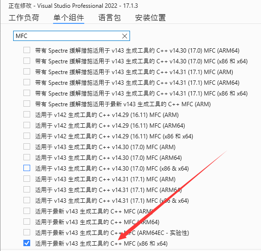
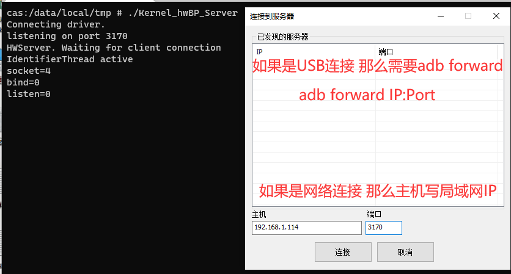

From [rwProcMem33](https://github.com/abcz316/rwProcMem33)

And Update By SsageParuders

---

## About Moudle

1. Change your `KERNEL_VERSION` on `ver_control`

2. Change your `KDIR` && `KBUILD_EXTRA_SYMBOLS` && `CROSS_COMPILE` && `CC` on `Makefile`

---

## About Server

1. Add `ndk-build` to PATH

2. Run `build.sh` or `clean.sh`

---

## About Client

1. Download Visual Studio And download MFC dependence , such as:<br>
    

2. Just build it

## About ExecTool

1. Add `ndk-build` to PATH

2. Run `build.sh` or `clean.sh`

## How To Use

### C/S

1. Start Kernel_hwBP_Server on Android:<br>
    ```bash
    # adb shell
    cd /data/local/tmp && chmod +x Kernel_hwBP_Server && ./Kernel_hwBP_Server
    ```

2. Add IP And Port for Client:<br>
    

### ExecTool

- Use ExecTool<br>
    ```bash
    Usage: ./Kernel_hwBP_Exec [-p <attach_pid>] [-a <memory_hex_addr>] [-l <hw_breakpoint_len>] [-t <hw_breakpoint_type>] [-d <is printf more?>] arg1 ...
    Example: ./Kernel_hwBP_Exec -p 8072 -a 9ECF6140 -l 8 -t rw -d F
    ```

---